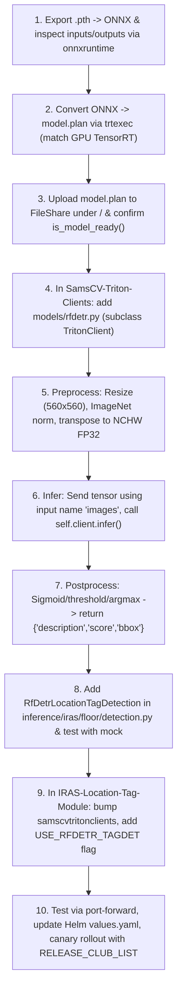

# Triton Model Deployment & Integration Guide (10-Step Workflow)

You do **NOT** need to create a new Triton server deployment on AKS. You can simply add your trained RF-DETR model as a **new version** in the existing Triton Model Repository on your Azure File Share, and the running Triton deployment will pick it up automatically.

---

## 10-Step End-to-End Workflow



---

### Step 1: Export `.pth` → ONNX & Inspect Input/Output Names/Shapes
- Run `multi_class_pipeline/09_convert_rfdetr_to_onnx.ipynb` to export the trained `.pth` checkpoint to `rfdetr_model.onnx`.
- Inspect graph signature with `onnxruntime`:
  - **Input**:
    - Name: `"images"`
    - Shape: `[1, 3, 1008, 1008]` (or `[1, 3, 560, 560]`, dtype: `float32`)
  - **Outputs**:
    - Name: `"scores"` — Shape: `[1, 300, 3]` (dtype: `float32`)
    - Name: `"boxes"` — Shape: `[1, 300, 4]` (cx, cy, w, h normalized [0, 1])

---

### Step 2: Convert ONNX → `model.plan` with `trtexec`
Convert using `convert_trtexec.sh` inside an environment matching the Triton GPU node's architecture (e.g., Tesla T4 on AKS):
```bash
./convert_trtexec.sh rfdetr_model.onnx model.plan 1008 4
```
Ensure `config.pbtxt` is configured with matching tensor names and dims:
```protobuf
name: "tagdet_rt"
platform: "tensorrt_plan"
max_batch_size: 4
input [
  { name: "images", data_type: TYPE_FP32, dims: [ 3, 1008, 1008 ] }
]
output [
  { name: "scores", data_type: TYPE_FP32, dims: [ 300, 3 ] },
  { name: "boxes",  data_type: TYPE_FP32, dims: [ 300, 4 ] }
]
```

---

### Step 3: Upload `model.plan` to Azure FileShare & Verify `is_model_ready()`
The Triton model repository structure on your Azure File Share (`aks-iras-t4-floor-models`):
```
aks-iras-t4-floor-models/
└── tagdet_rt/
    ├── config.pbtxt
    ├── 1/
    │   └── model.plan   # Previous model version
    └── 2/
        └── model.plan   # New version added here!
```
Upload using the automated script:
```bash
python upload_to_fileshare.py \
    --plan-file model.plan \
    --model-name rfdetr \
    --model-version 2 \
    --storage-account <YOUR_STORAGE_ACCOUNT> \
    --file-share <YOUR_FILE_SHARE> \
    --triton-url localhost:8001
```
Triton dynamically discovers version `2/model.plan` and reports ready.

---

### Step 4-7: `SamsCV-Triton-Clients/models/rfdetr.py`
Add [`models/rfdetr.py`](samscv_triton_clients/models/rfdetr.py) subclassing `TritonClient`:
- **Preprocess (Step 5)**: Resizes image to 560×560, normalizes by ImageNet mean `[0.485, 0.456, 0.406]` and std `[0.229, 0.224, 0.225]`, transposes to NCHW `(1, 3, 560, 560)`.
- **Infer (Step 6)**: Builds `InferInput("images")`, calls `self.client.infer(model_name="rfdetr", model_version="2", inputs=[...], outputs=[...])`.
- **Postprocess (Step 7)**: Computes sigmoid, argmax, applies confidence threshold (e.g. 0.40), converts boxes to `[ymin, xmin, ymax, xmax]` in pixel coordinates, and applies 4% boundary shrinkage. Returns list of `{"description", "score", "bbox"}` dicts.

---

### Step 8: `RfDetrLocationTagDetection` in `inference/iras/floor/detection.py`
Add [`inference/iras/floor/detection.py`](inference/iras/floor/detection.py) wrapping `RFDetrTritonClient`:
- Guarantees exact output format expected by the location tag module.
- Includes unit tests using `unittest.mock` to verify tensor serialization and response schemas without needing a live GPU.
- Run tests:
  ```bash
  python -m unittest inference/iras/floor/detection.py
  ```
- Bump package version and publish `samscvtritonclients`.

---

### Step 9: `IRAS-Location-Tag-Module/tag_detection.py`
Integrate the backend switcher with feature flags in [`tag_detection.py`](iras_location_tag_module/tag_detection.py):
- `USE_RFDETR_TAGDET`: Boolean flag to enable RF-DETR.
- `RFDETR_MODEL_NAME` & `RFDETR_MODEL_VERSION`: Target model in Triton.
- `RELEASE_CLUB_LIST`: Comma-separated list of club IDs (e.g., `"club_101,club_102"`).
- Automatically falls back to legacy detector if inference fails, guaranteeing zero service interruption.

---

### Step 10: Local Port-Forward Testing & Canary Rollout
1. **Port-forward existing Triton pod locally**:
   ```bash
   kubectl port-forward <triton-pod-name> 8001:8001 -n <namespace>
   ```
2. **Run end-to-end smoke test**:
   ```bash
   python test_triton_client.py --triton-url localhost:8001 --model-version 2 --image test.jpg
   ```
3. **Update Helm `values.yaml`**:
   Deploy canary configuration to pilot clubs first:
   ```yaml
   env:
     USE_RFDETR_TAGDET: "true"
     RFDETR_MODEL_NAME: "rfdetr"
     RFDETR_MODEL_VERSION: "2"
     RELEASE_CLUB_LIST: "club_101,club_102,club_105"
   ```
4. **Full Production Shift**:
   Once metrics are verified on pilot clubs, set `RELEASE_CLUB_LIST: ""` to shift 100% of club traffic to RF-DETR.
